# Array Reverse
*Source: GeeksforGeeks — Last Updated: 29 Mar, 2026*

Reverse an array `arr[]` — rearranging elements such that the first element becomes the last, the second becomes second-last, and so on.

**Examples:**
- Input: `arr[] = [1, 4, 3, 2, 6, 5]` → Output: `[5, 6, 2, 3, 4, 1]`
- Input: `arr[] = [4, 5, 1, 2]` → Output: `[2, 1, 5, 4]`

---

## [Naive Approach] Using a Temporary Array — O(n) Time and O(n) Space

The idea is to use a temporary array to store the reverse of the array.

1. Create a temporary array of the same size as the original array.
2. Copy all elements from the original array to the temporary array in **reverse order**.
3. Copy all elements from the temporary array back to the original array.

**Working:**

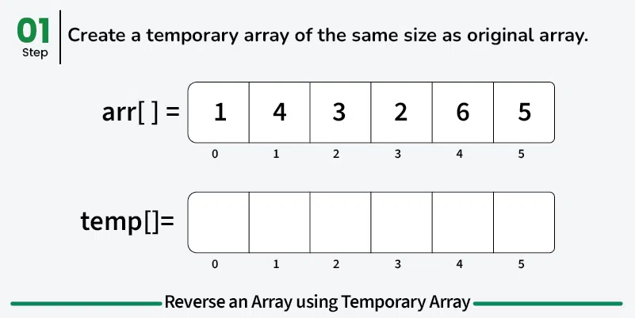
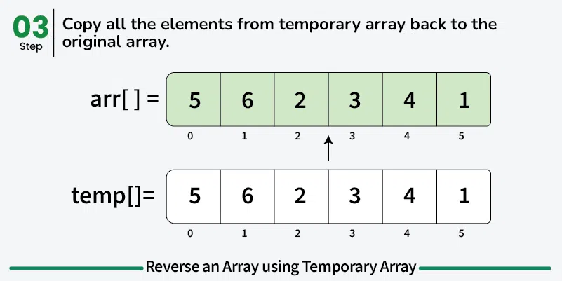
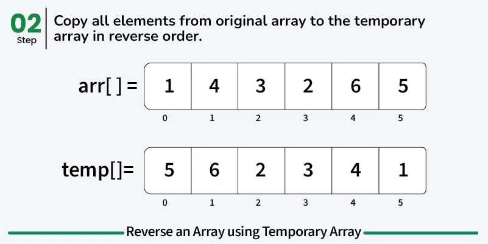

```python
def reverseArray(arr):
    n = len(arr)

    # Temporary array to store elements in reversed order
    temp = [0] * n

    # Copy elements from original array to temp in reverse order
    for i in range(n):
        temp[i] = arr[n - i - 1]

    # Copy elements back to original array
    for i in range(n):
        arr[i] = temp[i]

if __name__ == "__main__":
    arr = [1, 4, 3, 2, 6, 5]
    reverseArray(arr)
    for i in range(len(arr)):
        print(arr[i], end=" ")
```

**Output:**
```
5 6 2 3 4 1
```

- **Time Complexity:** O(n) — copying elements to a new array is a linear operation.
- **Auxiliary Space:** O(n) — extra array used to store the reversed array.

---

## [Expected Approach 1] Using Two Pointers — O(n) Time and O(1) Space

Maintain two pointers `left` and `right`, where `left` points to the beginning and `right` points to the end. While `left < right`, swap the elements at both positions, then increment `left` and decrement `right` to move toward the center.

**Working:**

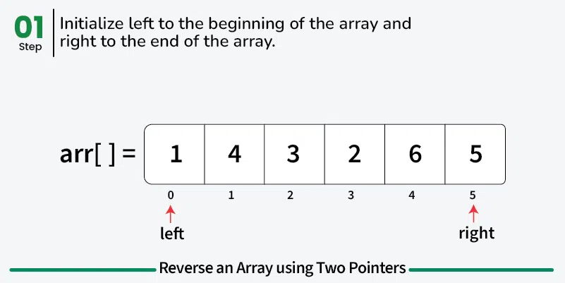
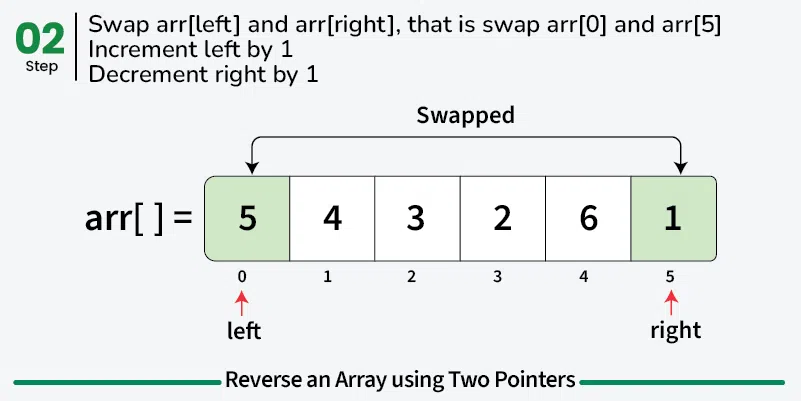
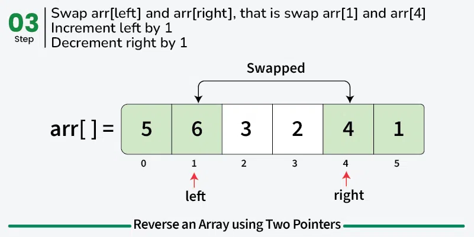
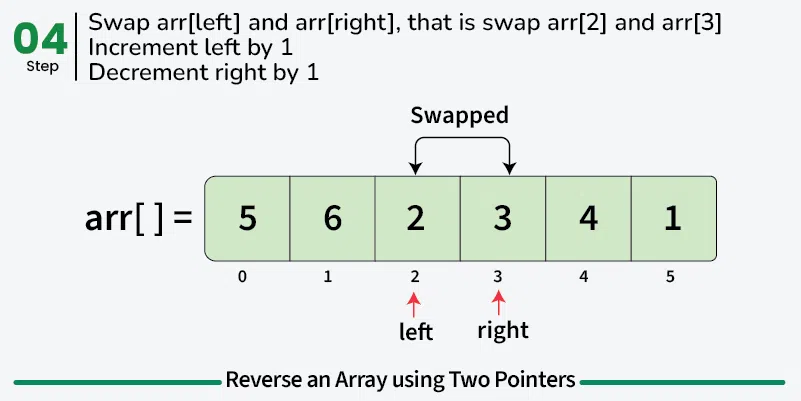
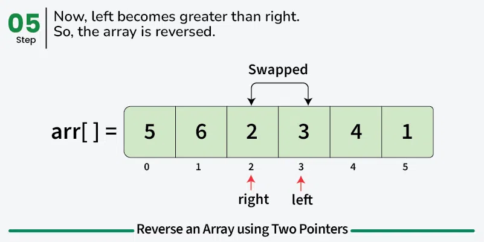

```python
def reverseArray(arr):

    # Initialize left to the beginning and right to the end
    left = 0
    right = len(arr) - 1

    # Iterate till left is less than right
    while left < right:

        # Swap the elements at left and right position
        arr[left], arr[right] = arr[right], arr[left]

        # Increment the left pointer
        left += 1

        # Decrement the right pointer
        right -= 1

if __name__ == "__main__":
    arr = [1, 4, 3, 2, 6, 5]
    reverseArray(arr)
    for i in range(len(arr)):
        print(arr[i], end=" ")
```

**Output:**
```
5 6 2 3 4 1
```

---

## [Expected Approach 2] Using Single Pointer — O(n) Time and O(1) Space

Iterate over the first half of the array and swap each element at index `i` with its corresponding element at index `(n - i - 1)`.

**Working:**

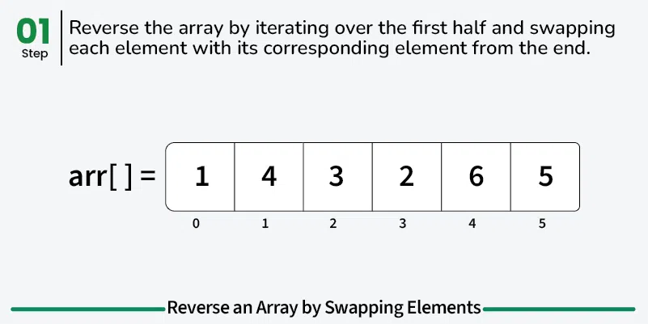
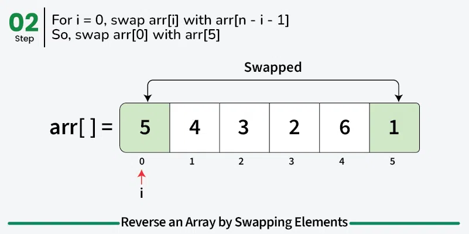
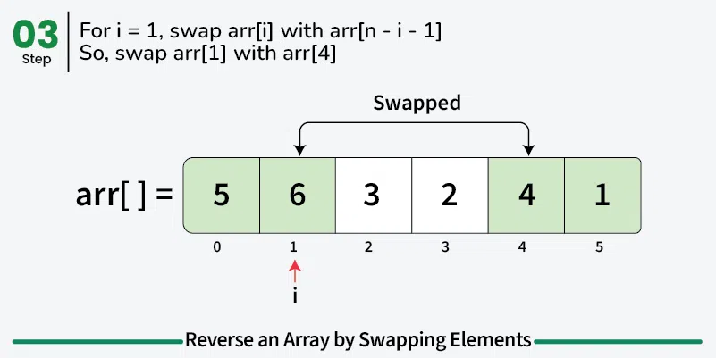
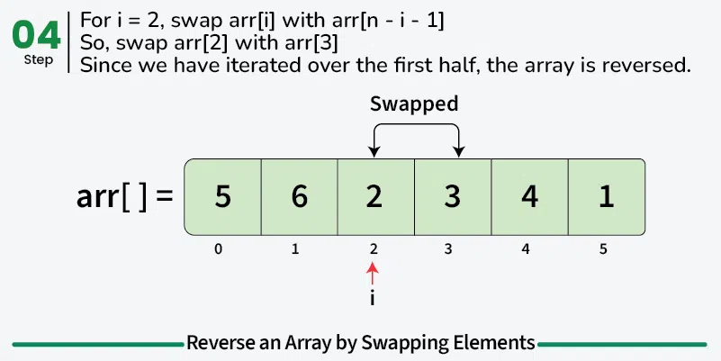

```python
def reverseArray(arr):
    n = len(arr)

    # Iterate over the first half and for every index i,
    # swap arr[i] with arr[n - i - 1]
    for i in range(n // 2):
        temp = arr[i]
        arr[i] = arr[n - i - 1]
        arr[n - i - 1] = temp

if __name__ == "__main__":
    arr = [1, 4, 3, 2, 6, 5]
    reverseArray(arr)
    for i in range(len(arr)):
        print(arr[i], end=" ")
```

**Output:**
```
5 6 2 3 4 1
```

- **Time Complexity:** O(n) — the loop runs through half of the array.
- **Auxiliary Space:** O(1) — no extra space required, reversed in-place.

---

## Using Inbuilt Methods — O(n) Time and O(1) Space

Use the built-in `reverse()` method available in Python:

```python
def reverseArray(arr):
    arr.reverse()

if __name__ == "__main__":
    arr = [1, 4, 3, 2, 6, 5]
    reverseArray(arr)
    print(" ".join(map(str, arr)))
```

**Output:**
```
5 6 2 3 4 1
```

- **Time Complexity:** O(n) — the reverse method has linear time complexity.
- **Auxiliary Space:** O(1) — values are swapped in-place, no additional storage used.