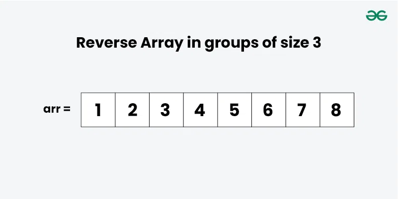
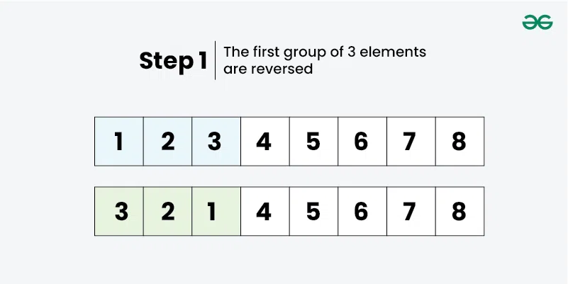
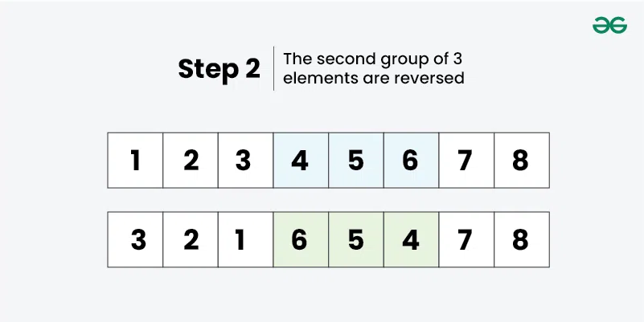
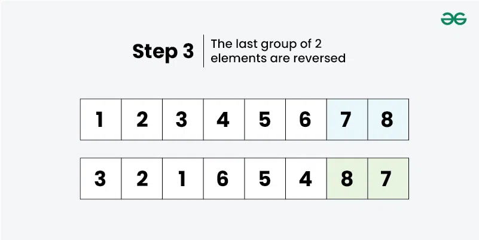

# Reverse an Array in Groups
*Source: GeeksforGeeks — Last Updated: 28 Mar, 2026*

Given an array `arr[]` and an integer `k`, reverse every subarray of consecutive `k` elements in place. If the last subarray has fewer than `k` elements, reverse it as is.

**Examples:**
- Input: `arr[] = [1, 2, 3, 4, 5, 6, 7, 8], k = 3` → Output: `[3, 2, 1, 6, 5, 4, 8, 7]`
  - `[1, 2, 3]` → `[3, 2, 1]`, `[4, 5, 6]` → `[6, 5, 4]`, `[7, 8]` (size < 3) → `[8, 7]`
- Input: `arr[] = [1, 2, 3, 4, 5], k = 3` → Output: `[3, 2, 1, 5, 4]`
  - First group: `[1, 2, 3]`, second group: `[4, 5]`
- Input: `arr[] = [5, 6, 8, 9], k = 5` → Output: `[9, 8, 6, 5]`
  - Since `k` is greater than array size, the entire array is reversed.

---

## Fixed-Size Group Reversal — O(n) Time and O(1) Space

**Edge cases:**
- When `k = 1`, the array stays the same.
- When `k` is greater than or equal to the array size, the entire array is reversed.

**Approach:**
- Begin from index `0` and find the size of the current subarray to reverse. If remaining elements are fewer than `k`, reverse all of them.
- Each subarray is reversed using **two pointers** starting from the two corners of the subarray.

**Working:**






```python
def reverseInGroups(arr, k):
    i = 0
    n = len(arr)

    while i < n:
        left = i

        # To handle case when k is not a multiple of n
        right = min(i + k - 1, n - 1)

        # Reverse the sub-array [left, right]
        while left < right:
            arr[left], arr[right] = arr[right], arr[left]
            left += 1
            right -= 1

        i += k

if __name__ == "__main__":
    arr = [1, 2, 3, 4, 5, 6, 7, 8]
    k = 3
    reverseInGroups(arr, k)
    print(" ".join(map(str, arr)))
```

**Output:**
```
3 2 1 6 5 4 8 7
```