# Rotate an Array — Clockwise or Right
*Source: GeeksforGeeks — Last Updated: 1 Apr, 2026*

Rotation is the process of rearranging elements in an array by shifting each element to a new position — clockwise or counterclockwise.

---

### Right Rotation (or Clockwise)
The array elements are shifted towards the right.

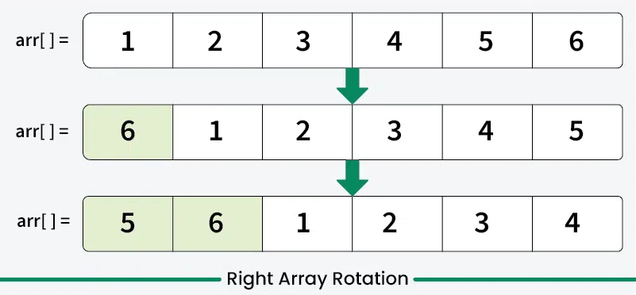

### Left Rotation (or Counter Clockwise)
The array elements are shifted towards the left.

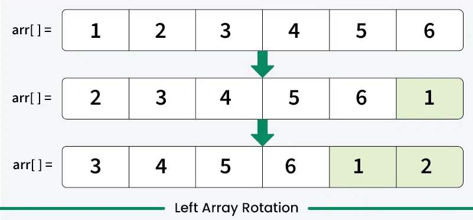

> In this article, we discuss **right rotation**. Refer to *Left rotate an array by d positions* for left rotation.

---

## How to Implement Rotation?

**Input:** `arr[] = {1, 2, 3, 4, 5, 6}, d = 2`
**Output:** `{5, 6, 1, 2, 3, 4}`

- After 1st right rotation → `{6, 1, 2, 3, 4, 5}`
- After 2nd right rotation → `{5, 6, 1, 2, 3, 4}`

**Input:** `arr[] = {1, 2, 3}, d = 4` → **Output:** `{3, 1, 2}`

---

## 1. Rotate One by One

At each iteration, shift elements one position to the right in a circular fashion (last element becomes first). Perform this `d` times.

**Illustration for `arr[] = {1, 2, 3, 4, 5, 6}, d = 2` :**
```
Step 1 → rotate right by 1 : arr[] = {6, 1, 2, 3, 4, 5}
Step 2 → rotate right by 1 : arr[] = {5, 6, 1, 2, 3, 4}
```

```python
# Right rotate the array by d positions, one element at a time

def rotateArr(arr, d):
    n = len(arr)

    # Repeat the rotation d times
    for _ in range(d):

        # Right rotate the array by one position
        last = arr[n - 1]
        for i in range(n - 1, 0, -1):
            arr[i] = arr[i - 1]
        arr[0] = last

if __name__ == "__main__":
    arr = [1, 2, 3, 4, 5, 6]
    d = 2
    rotateArr(arr, d)
    for i in range(len(arr)):
        print(arr[i], end=" ")
```

**Output:**
```
5 6 1 2 3 4
```

- **Time Complexity:** O(n × d)
- **Auxiliary Space:** O(1)

---

## 2. Using Temporary Array

If we right rotate by `d` positions, the last `d` elements go to the beginning and the first `(n - d)` elements go to the end.

- Copy the last `d` elements into the first `d` positions of a temporary array.
- Copy the first `n - d` elements to the end of the temporary array.
- Copy all elements of the temporary array back to the original array.

**Illustration for Right Rotation by 2 positions:**

.webp)
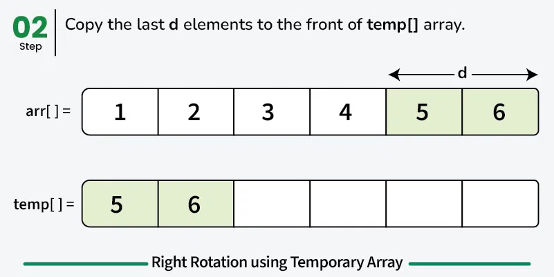
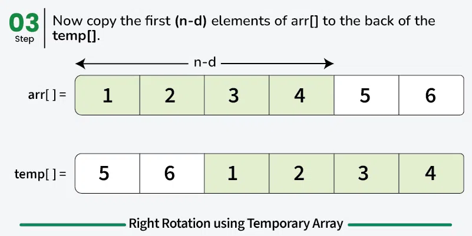
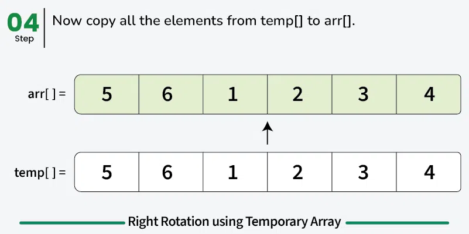

```python
# Right rotate the array by d positions using temporary array

def rotateArr(arr, d):
    n = len(arr)

    # Handle case when d > n
    d %= n

    # Storing rotated version of array
    temp = [0] * n

    # Copy last d elements to the front of temp
    for i in range(d):
        temp[i] = arr[n - d + i]

    # Copy the first n - d elements to the back of temp
    for i in range(n - d):
        temp[i + d] = arr[i]

    # Copy elements of temp back to arr
    for i in range(n):
        arr[i] = temp[i]

if __name__ == "__main__":
    arr = [1, 2, 3, 4, 5, 6]
    d = 2
    rotateArr(arr, d)
    print(' '.join(map(str, arr)))
```

**Output:**
```
5 6 1 2 3 4
```

- **Time Complexity:** O(n)
- **Auxiliary Space:** O(n)

---

## 3. Juggling Algorithm

Instead of moving one by one, we use **cycles**. Each cycle is independent and represents a group of elements that shift among themselves. If the starting index of a cycle is `i`, the next elements are at indices `(i + d) % n`, `(i + 2d) % n`, ... until we reach back to `i`.

For any index `i`, the element moves to index `(i + d) % n`. We rotate all elements in the same cycle without interfering with any other cycle.

**Working of the above algorithm:**

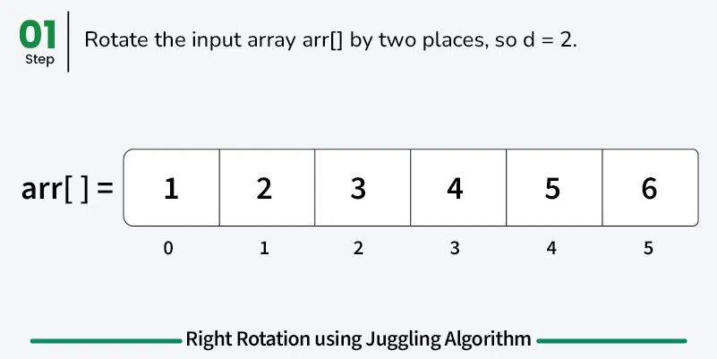
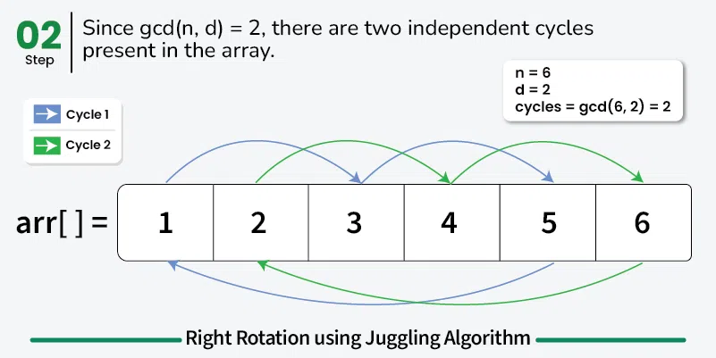
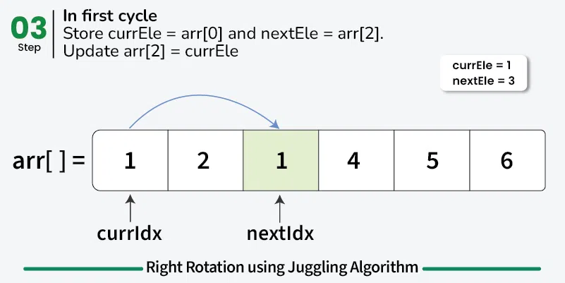
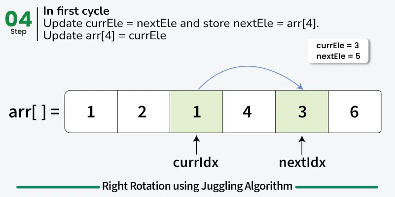
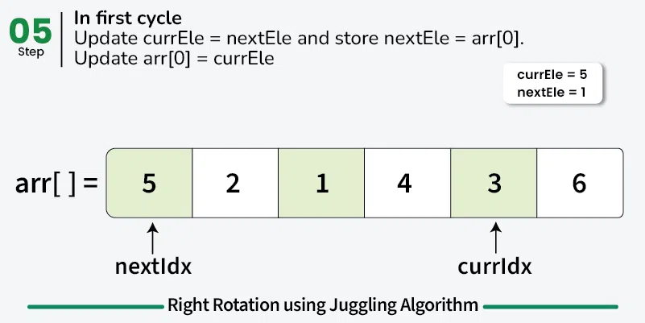
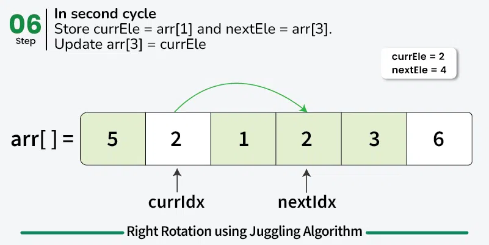
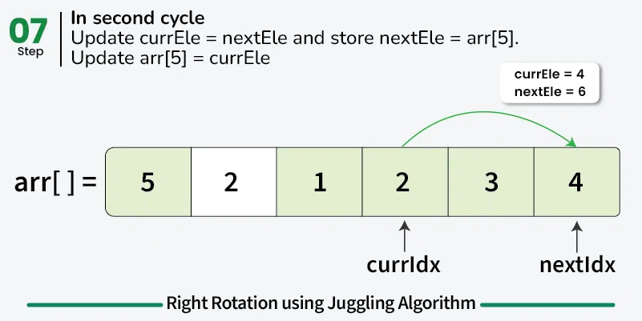
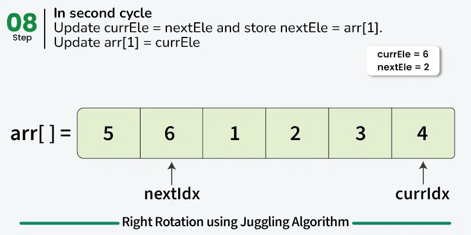

```python
# Right rotate the array by d positions using Juggling Algorithm

from math import gcd

def rotateArr(arr, d):
    n = len(arr)

    # Handle case where d > size of array
    d %= n

    # Calculate the number of cycles in the rotation
    cycles = gcd(n, d)

    # Process each cycle
    for i in range(cycles):

        # Start index of current cycle
        currIdx = i
        currEle = arr[currIdx]

        # Rotate elements till we reach the start of cycle
        while True:
            nextIdx = (currIdx + d) % n
            nextEle = arr[nextIdx]

            # Update the element at next index with the current element
            arr[nextIdx] = currEle

            # Update the current element to next element
            currEle = nextEle

            # Move to the next index
            currIdx = nextIdx

            if currIdx == i:
                break

if __name__ == "__main__":
    arr = [1, 2, 3, 4, 5, 6]
    d = 2
    rotateArr(arr, d)
    for i in range(len(arr)):
        print(arr[i], end=" ")
```

**Output:**
```
5 6 1 2 3 4
```

---

## 4. The Reversal Algorithm

If we right rotate by `d` positions, the last `d` elements go to the front and the first `(n - d)` elements go to the end.

1. Reverse the **entire** array.
2. Reverse the **first `d` elements**.
3. Reverse the **last `(n - d)` elements**.

**Illustration:**

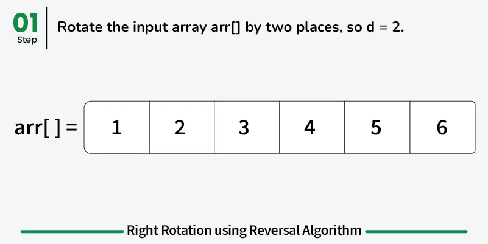
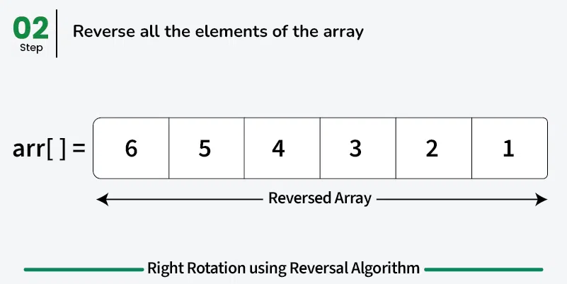
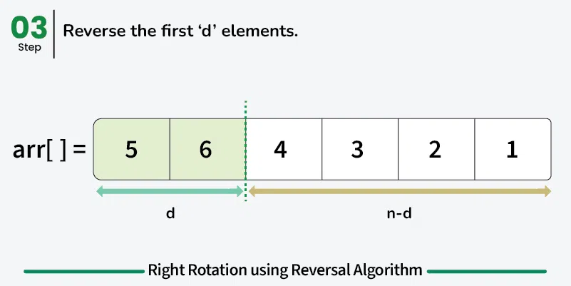
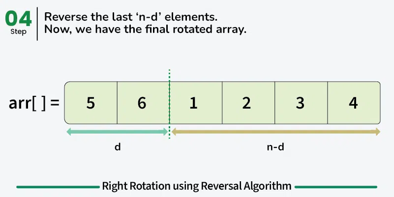

```python
# Right rotate an array using Reversal Algorithm

def rotateArr(arr, d):
    n = len(arr)

    # Handle case where d > size of array
    d %= n

    # Reverse the entire array
    arr.reverse()

    # Reverse the first d elements
    arr[:d] = reversed(arr[:d])

    # Reverse the remaining n-d elements
    arr[d:] = reversed(arr[d:])

if __name__ == "__main__":
    arr = [1, 2, 3, 4, 5, 6]
    d = 2
    rotateArr(arr, d)
    for i in range(len(arr)):
        print(arr[i], end=" ")
```

**Output:**
```
5 6 1 2 3 4
```

- **Time Complexity:** O(n)
- **Auxiliary Space:** O(1)

---

## Related Articles

- Program for array left rotation by d positions
- Find the Rotation Count in Rotated Sorted Array
- Maximum sum of `i * arr[i]` among all rotations of a given array
- Find the Minimum element in a Sorted and Rotated Array
- Quickly find multiple left rotations of an array