# Stock Buy and Sell — Multiple Transactions Allowed
*Source: GeeksforGeeks — Last Updated: 9 Feb, 2026*

Given an array `prices[]` representing stock prices, find the **maximum total profit** that can be earned by buying and selling the stock any number of times.

> **Note:** We can only sell a stock we have bought earlier and cannot hold multiple stocks on the same day.

**Examples:**

- Input: `prices[] = [100, 180, 260, 310, 40, 535, 695]` → Output: `865`
  - Buy day 0, sell day 3 → `310 - 100 = 210`
  - Buy day 4, sell day 6 → `695 - 40 = 655`
  - Maximum profit = `210 + 655 = 865`

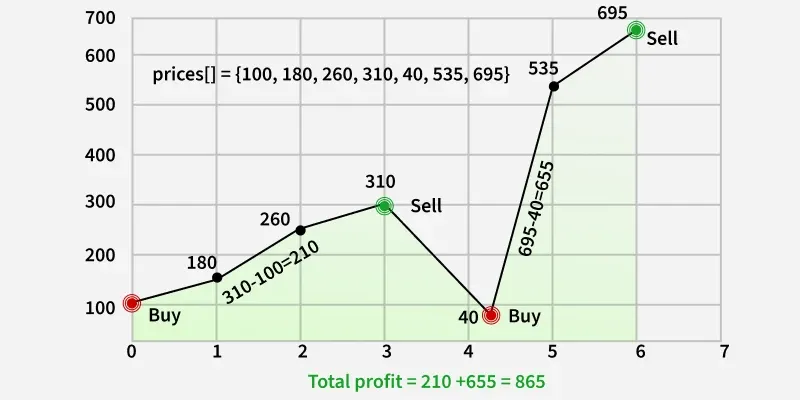

- Input: `prices[] = [4, 2]` → Output: `0` — prices keep decreasing, no profit possible.

---

## [Naive Approach] By Trying All Possibilities — O(2ⁿ) Time and O(n) Space

Use recursion to simulate all choices of buying and selling. For each day, either skip it or buy. If buying at day `i`, try all possible selling days `j > i` where `price[j] > price[i]`.

```python
def maxProfitRec(price, start, end):
    res = 0

    # Try every possible pair of buy (i) and sell (j)
    for i in range(start, end):
        for j in range(i + 1, end + 1):

            # Valid transaction if selling price > buying price
            if price[j] > price[i]:
                curr = (price[j] - price[i]) + \
                       maxProfitRec(price, start, i - 1) + \
                       maxProfitRec(price, j + 1, end)
                res = max(res, curr)
    return res

def maxProfit(prices):
    return maxProfitRec(prices, 0, len(prices) - 1)

if __name__ == "__main__":
    prices = [100, 180, 260, 310, 40, 535, 695]
    print(maxProfit(prices))
```

**Output:**
```
865
```

---

## [Better Approach] Using Local Minima and Maxima — O(n) Time and O(1) Space

Traverse the array from left to right. Find a **local minima** (where price starts rising), then a **local maxima** (where price stops rising). Add the difference to the result.

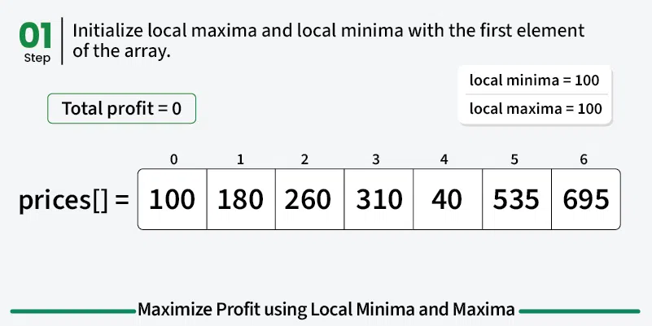
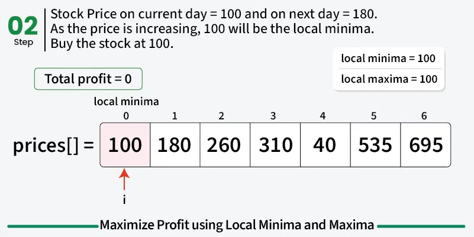
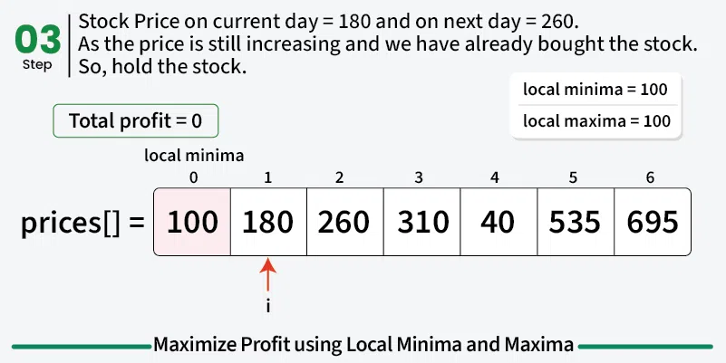
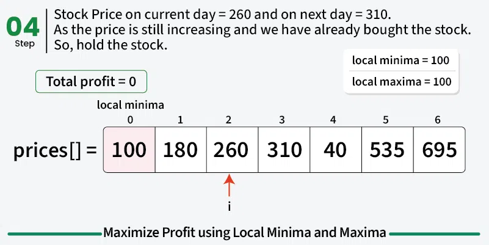
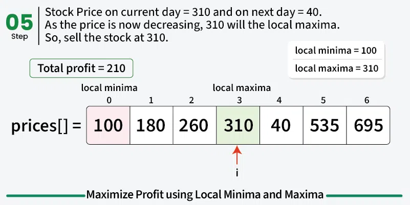
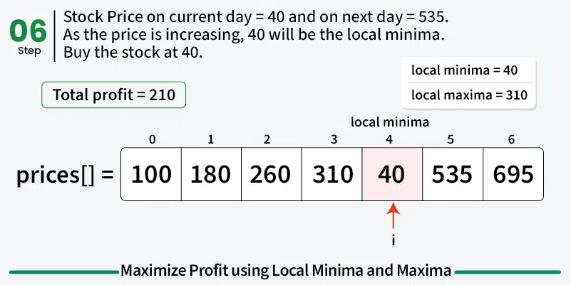
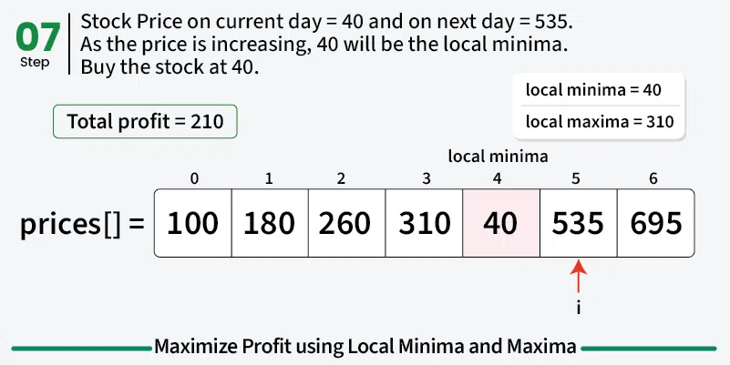
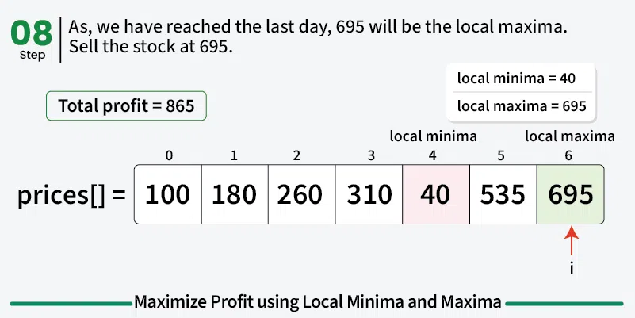

```python
def maxProfit(prices):
    n = len(prices)
    lMin = prices[0]
    lMax = prices[0]
    res = 0

    i = 0
    while i < n - 1:

        # Find local minima
        while i < n - 1 and prices[i] >= prices[i + 1]:
            i += 1
        lMin = prices[i]

        # Find local maxima
        while i < n - 1 and prices[i] <= prices[i + 1]:
            i += 1
        lMax = prices[i]

        # Add current profit
        res += (lMax - lMin)

    return res

if __name__ == "__main__":
    prices = [100, 180, 260, 310, 40, 535, 695]
    print(maxProfit(prices))
```

**Output:**
```
865
```

---

## [Expected Approach] By Accumulating Profit — O(n) Time and O(1) Space

Profit only comes when prices rise. If the price goes up from one day to the next, we can think of it as buying yesterday and selling today. Instead of waiting for the exact bottom and top, we grab every small upward move. Adding these small gains together equals buying at each valley and selling at each peak, since every rise between them gets counted.

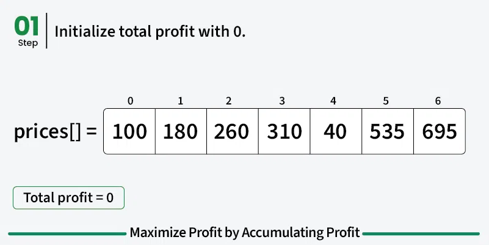
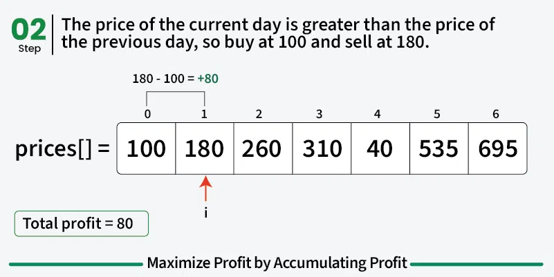
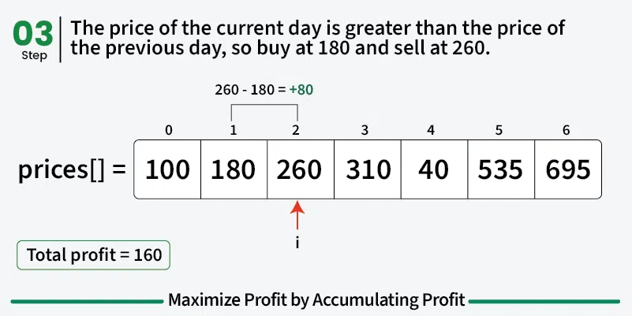
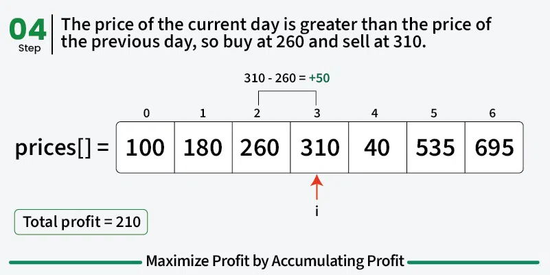
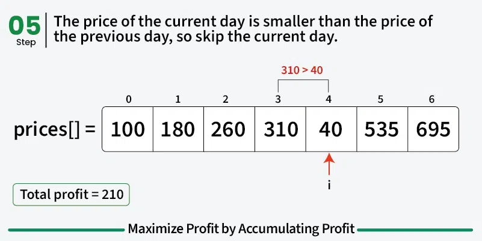
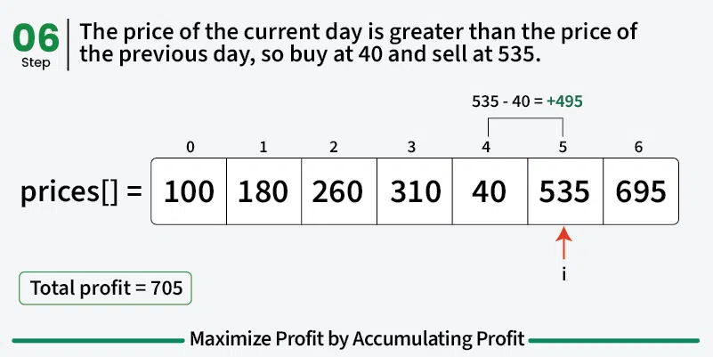
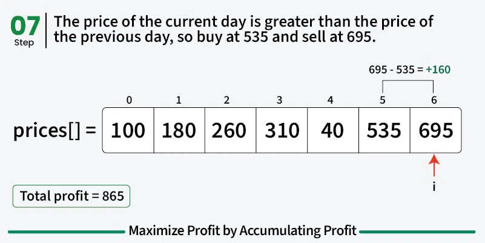

```python
def maxProfit(prices):
    res = 0

    # Add the difference between adjacent prices when rising
    for i in range(1, len(prices)):
        if prices[i] > prices[i - 1]:
            res += prices[i] - prices[i - 1]

    return res

if __name__ == "__main__":
    prices = [100, 180, 260, 310, 40, 535, 695]
    print(maxProfit(prices))
```

**Output:**
```
865
```

---

## Related Problems

- Stock Buy and Sell — k Transactions Allowed
- Stock Buy and Sell — 2 Transactions Allowed
- Stock Buy and Sell — 1 Transaction Allowed
- Stock Buy and Sell — With Transaction Fee

> Please refer to *Stock Buy and Sell Complete Tutorial* for the complete list.