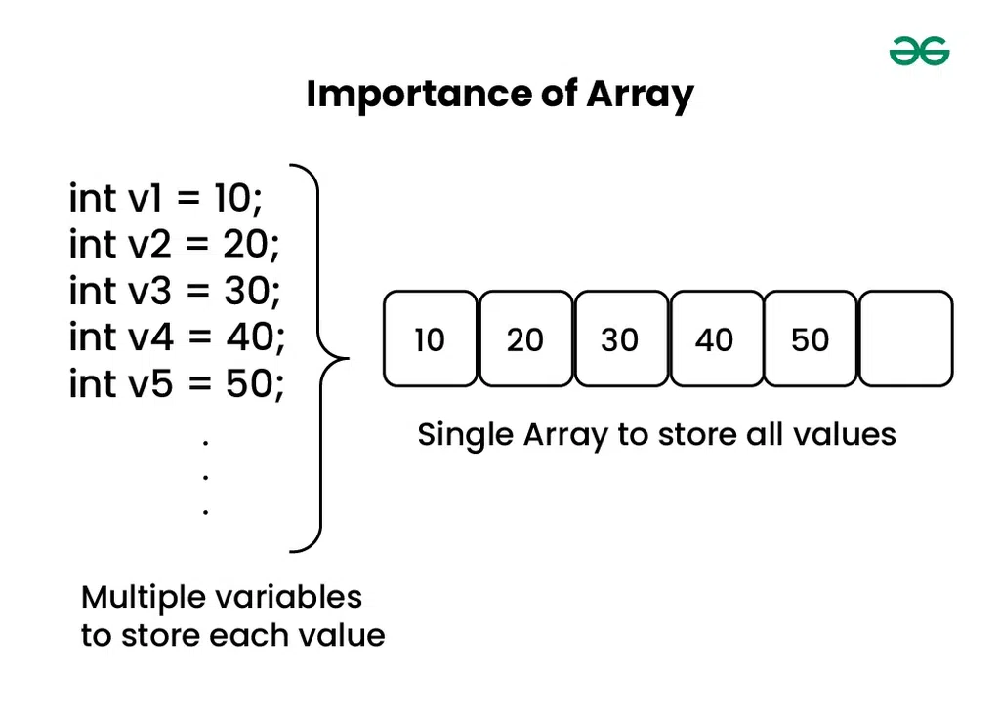
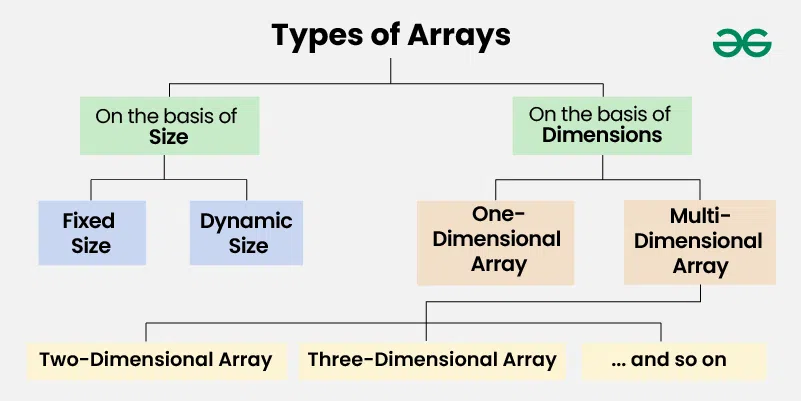

# Array Introduction
*Source: GeeksforGeeks — Last Updated: 16 Feb, 2026*

An **array** is a collection of items of the same variable type stored at **contiguous memory locations**. It is one of the most popular and simple data structures used in programming.

---

## Basic Terminologies of Array

- **Array Element:** Items stored in an array.
- **Array Index:** Elements are accessed by their indexes. Indexes in most programming languages start from `0`.

---

## Memory Representation of Array

In an array, all elements or their references are stored in **contiguous memory locations**, allowing for efficient access and manipulation of elements.

---

## Declaration of Array

Arrays can be declared in various ways in different languages:

```python
# In Python, all types of lists are created the same way
arr = []
```

---

## Initialization of Array

```python
# This list will store integer type elements
arr = [1, 2, 3, 4, 5]

# This list will store character type elements (strings in Python)
arr = ['a', 'b', 'c', 'd', 'e']

# This list will store float type elements
arr = [1.4, 2.0, 24.0, 5.0, 0.0]
```

---

## Why Do We Need Arrays?

Assume there is a class of five students and we need to keep records of their marks. We could declare five individual variables — but if the number of students becomes very large, it would be challenging to manipulate and maintain the data. Arrays solve this problem by storing all values under a single structure.



---

## Types of Arrays

Arrays can be classified in two ways:
- On the basis of **Size**
- On the basis of **Dimensions**



---

## Types of Arrays on the Basis of Size

### 1. Fixed Sized Arrays

- We cannot alter or update the size of this array — only a fixed amount of memory (declared in `[]`) is allocated for storage.
- Declaring a size larger than needed wastes memory; declaring a size smaller than needed means not all elements can be stored.

```python
# Create a fixed-size list of length 5, initialized with zeros
arr = [0] * 5

# Output the fixed-size list
print(arr)
```

### 2. Dynamic Sized Arrays

The size changes as per user requirements during execution — coders do not need to worry about sizes. Elements can be added and removed as needed, with memory dynamically allocated and de-allocated.

```python
# Dynamic Array
arr = []
```

---

## Types of Arrays on the Basis of Dimensions

### 1. One-Dimensional Array (1-D Array)

A 1-D array can be imagined as a **row** where elements are stored one after another.

-1024.webp)

### 2. Multi-Dimensional Array

A multi-dimensional array is an array with **more than one dimension**. It can be used to store complex data in the form of tables. We can have 2-D, 3-D, 4-D arrays and so on.

#### Two-Dimensional Array (2-D Array or Matrix)
A 2-D array can be considered as an **array of arrays**, or as a matrix consisting of rows and columns.

> To read more, refer to *Matrix Data Structure*.

-1024.webp)

#### Three-Dimensional Array (3-D Array)
A 3-D array contains three dimensions — it can be considered as an **array of two-dimensional arrays**.

-1024.webp)