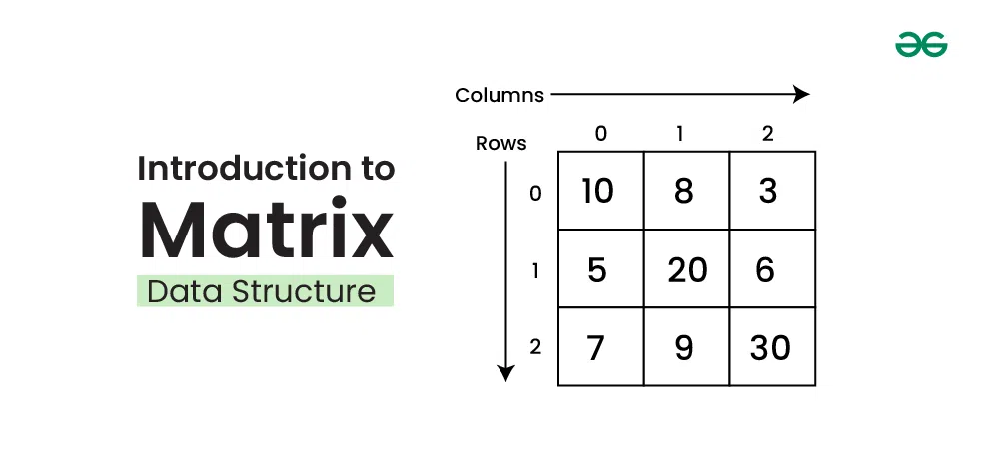
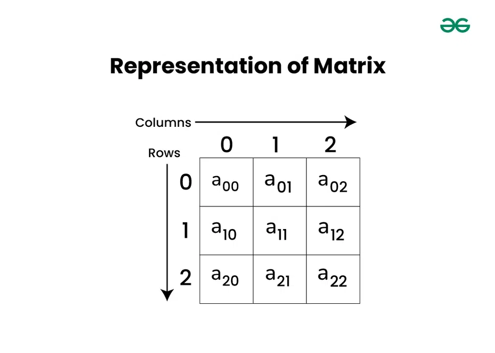
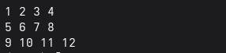
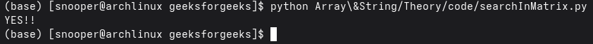

# Matrix or Grid or 2D Array — Complete Tutorial
*Source: GeeksforGeeks — Last Updated: 11 May, 2026*

**Matrix or Grid** is a two-dimensional array mostly used in mathematical and scientific calculations. It is also considered as an **array of arrays**, where the array at each index has the same size.



---

## Representation of Matrix Data Structure

Elements are organized in **rows and columns**. The cell `a[0][0]` is the first element of the first row and first column.



---

## Declaration of Matrix Data Structure

Declaration of a matrix (two-dimensional array) is very similar to that of a one-dimensional array:

```python
# Defining number of rows and columns in matrix
rows = 3
cols = 3

# Declaring a matrix of size 3×3, initialized with value zero
rows, cols = (3, 3)
arr = [[0] * cols] * rows
print(arr)
```

---

## Initializing Matrix Data Structure

In initialization, we assign initial values to all cells of the matrix:

```python
# Initializing a 2-D array with values
arr = [[1, 2, 3], [4, 5, 6], [7, 8, 9]]
```

---

## Operations on Matrix Data Structure

### 1. Access Elements of Matrix

Like one-dimensional arrays, matrices can be accessed randomly using their indices. A cell has two indices — one for its **row number** and one for its **column number**. We use `arr[i][j]` to access the element at the `i`-th row and `j`-th column.

```python
# Initializing a 2-D array with values
arr = [[1, 2, 3], [4, 5, 6], [7, 8, 9]]

# Accessing elements of 2-D array
print("First element of first row:", arr[0][0])
print("Third element of second row:", arr[1][2])
print("Second element of third row:", arr[2][1])
```

---

### 2. Traversal of a Matrix

We can traverse all elements of a matrix using **two nested for-loops**:

```python
# Initializing a 2-D list with values
arr = [
    [1,  2,  3,  4],
    [5,  6,  7,  8],
    [9, 10, 11, 12]
]

# Traversing each row
for row in arr:

    # Traversing each element in the current row
    for x in row:
        print(x, end=" ")
    print()
```

**Output:**



---

### 3. Searching in a Matrix

We can search for an element in a matrix by traversing all its elements:

```python
# Function to search for an element in a 2-D list
def search_in_matrix(arr, x):
    rows, cols = len(arr), len(arr[0])

    # Traverse each row and column
    for i in range(rows):
        for j in range(cols):
            if arr[i][j] == x:
                return True
    return False

# Driver code to test the function
x = 8
arr = [
    [0,   6,   8,   9,  11],
    [20,  22,  28,  29,  31],
    [36,  38,  50,  61,  63],
    [64,  66, 100, 122, 128]
]

if search_in_matrix(arr, x):
    print("YES")
else:
    print("NO")
```

**Output:**

