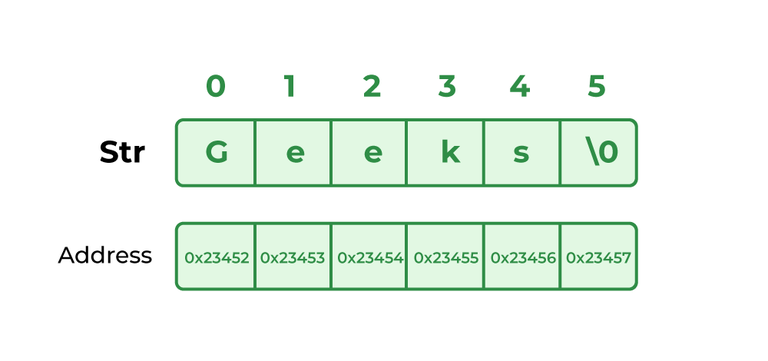

# Introduction to Strings
*Source: GeeksforGeeks — Last Updated: 20 Jan, 2026*

**Strings** are sequences of characters. The differences between a character array and a string are: a string is terminated with a special character `\0`, and strings are typically **immutable** in most programming languages like Java, Python, and JavaScript.

**Examples of strings:**
```
"geeks", "for", "geeks", "GeeksforGeeks", "Geeks for Geeks", "123Geeks", "@123 Geeks"
```

---

## How Strings are Represented in Memory?

- **C:** Strings are declared as character arrays or pointers and must end with a null character (`\0`) to indicate termination.
- **C++:** Supports both C-style character arrays and the `std::string` class, which provides built-in functions for string manipulation.
- **Java:** Strings are immutable objects of the `String` class — their values cannot be modified once assigned.
- **Python:** Strings are immutable and can be declared using single, double, or triple quotes, making them flexible for multi-line text handling.
- **JavaScript:** Strings are immutable primitive data types and can be defined using single, double, or template literals (backticks), allowing for interpolation.
- **C#:** Uses the `string` keyword, which represents an immutable sequence of characters, similar to Java.

> **Note:** There is no character type in Python and JavaScript — a single character is also considered a string.



---

## How to Declare Strings in Various Languages?

```python
# Python Program for Creation of String

# Creating a String with single quotes
String1 = 'Welcome to the Geeks World'
print("String with the use of Single Quotes: ")
print(String1)

# Creating a String with double quotes
String1 = "I'm a Geek"
print("\nString with the use of Double Quotes: ")
print(String1)

# Creating a String with triple quotes
String1 = '''I'm a Geek and I live in a world of "Geeks"'''
print("\nString with the use of Triple Quotes: ")
print(String1)

# Creating a multiline String with triple quotes
String1 = '''Geeks
            For
            Life'''
print("\nCreating a multiline String: ")
print(String1)
```

---

## Are Strings Mutable in Different Languages?

- In **C/C++**, string literals (assigned to pointers) are immutable.
- In **C++**, string objects are mutable.
- In **Python, Java, and JavaScript**, strings are immutable.

```python
# Create an immutable string
s = "GFG"

# This will cause an error because strings are immutable
s[1] = 'f'

print(s)
```

---

## General Operations Performed on Strings

- **Length of String:** The total number of characters present in a string, including letters, digits, spaces, and special characters. Fundamental for validation, manipulation, and comparison.

- **Search a Character:** Finding the position where a specific character appears — first occurrence, last occurrence, or all occurrences.

- **Check for Substring:** Determining whether a smaller sequence of characters exists within a larger string. Common in text processing, search algorithms, and data validation.

- **Insert a Character:** Adding a new character at a specific position while maintaining the original order. Since strings are immutable in many languages, this usually involves creating a new modified string.

- **Delete a Character:** Removing a specific character at a given position while keeping the remaining characters intact. Also involves creating a new string without the specified character.

- **Check for Same Strings:** Comparing two strings character by character to determine if they are identical in length, order, and content.

- **String Concatenation:** Joining two or more strings together to form a single string. Useful for text processing, formatting messages, constructing file paths, or dynamically creating content.

- **Reverse a String:** Arranging a string's characters in the opposite order. Commonly used in text manipulation, data encryption, and algorithm challenges.

- **Rotate a String:** Shifting characters to the left or right by a specified number of positions, with characters that move past the boundary wrapping around to the other side.

- **Check for Palindrome:** Determining whether a string reads the same forward and backward. A palindrome remains unchanged when reversed.