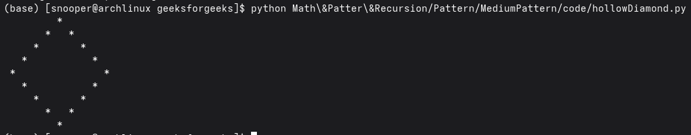

# Hollow Diamond Pattern
*Source: GeeksforGeeks — Last Updated: 11 Mar, 2026*

Given an integer `N`, print a hollow diamond pattern.

**Examples:**

- Input: `N = 5`
```
        *
      *   *
    *       *
  *           *
*               *
  *           *
    *       *
      *   *
        *
```

- Input: `N = 3`
```
    *
  *   *
*       *
  *   *
    *
```

---

## Using Nested Loops — O(n²) Time and O(1) Space

- Iterate through `2 × n − 1` rows to form the upper and lower parts of the pattern, and compute a variable `comp` to control the spacing for each row.
- Print leading spaces using an inner loop so that the stars shift toward the center and form the desired shape.
- Use another inner loop to print stars at the first and last positions of the row and spaces in between, creating a hollow pattern.

```python
def main():
    n = 3

    # Outer loop for rows
    for i in range(2 * n - 1):

        comp = 2 * (n - i) - 1 if i < n else 2 * (i - n + 1) + 1

        # Print leading spaces
        for j in range(comp):
            print(' ', end='')

        # Print stars and inner spaces
        for k in range(2 * n - comp):
            if k == 0 or k == 2 * n - comp - 1:
                print('* ', end='')
            else:
                print('  ', end='')

        print()


if __name__ == "__main__":
    main()
```

**Output:**

