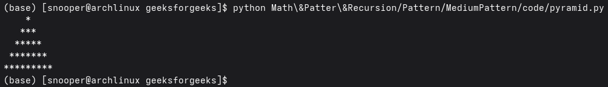

# Printing Pyramid Patterns
*Source: GeeksforGeeks — Last Updated: 11 Mar, 2026*

Given a positive integer `n`, print a center-aligned pyramid pattern of stars where the number of rows equals `n`.

**Examples:**

- Input: `n = 5`
```
    *
   ***
  *****
 *******
*********
```

- Input: `n = 3`
```
  *
 ***
*****
```

- Input: `n = 7`
```
      *
     ***
    *****
   *******
  *********
 ***********
*************
```

---

## Using Two Loops — O(n²) Time and O(1) Space

The outer loop tracks the rows, while the inner loops print the required spaces and stars for each row.

**Illustration:**

- For every row `i` (from `1` to `n`), the pyramid must remain center-aligned.
- First print spaces, then print stars (`*`).
- The number of leading spaces for row `i` is `n - i`, which decreases as the row increases.
- After spaces, print `2 × i − 1` stars.
- This pattern makes the pyramid grow symmetrically from the center.

```python
def print_pyramid(n):

    # Outer loop for rows
    for i in range(1, n + 1):

        # Print spaces
        print(" " * (n - i), end="")

        # Print stars
        print("*" * (2 * i - 1))


if __name__ == "__main__":
    n = 5
    print_pyramid(n)
```

**Output:**

