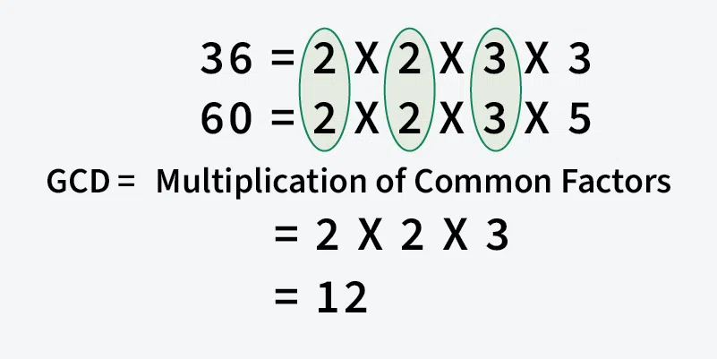

# Program to Find GCD or HCF of Two Numbers
*Source: GeeksforGeeks — Last Updated: 6 Mar, 2026*

Given two positive integers `a` and `b`, find their GCD.

> **Note:** The GCD (Greatest Common Divisor) or HCF (Highest Common Factor) of two numbers is the largest number that divides both of them.



**Examples:**
- Input: `a = 20, b = 28` → Output: `4` — common factors of 20 and 28 are 1, 2, 4 — the greatest is 4.
- Input: `a = 60, b = 36` → Output: `12`

---

## [Approach 1] Using Loop — O(min(a, b)) Time and O(1) Space

Find the minimum of the two numbers, then find its highest factor that is also a factor of the other number.

```python
def gcd(a, b):

    # Everything divides 0
    if a == 0 or b == 0:
        return max(a, b)

    # Find minimum of a and b
    result = min(a, b)

    while result > 0:
        if a % result == 0 and b % result == 0:
            break
        result -= 1

    # Return gcd of a and b
    return result

if __name__ == '__main__':
    a = 20
    b = 28
    print(gcd(a, b))
```

**Output:**
```
4
```

---

## [Approach 2] Euclidean Algorithm using Subtraction — O(min(a, b)) Time and O(min(a, b)) Space

The GCD of two numbers doesn't change if the smaller number is subtracted from the bigger one. This process repeats, carrying the result forward each time, until both numbers become equal.

**Pseudo-code:**
```
gcd(a, b):
    if a == b:
        return a
    if a > b:
        return gcd(a - b, b)
    else:
        return gcd(a, b - a)
```

```python
def gcd(a, b):

    # Everything divides 0
    if a == 0:
        return b
    if b == 0:
        return a

    # Base case
    if a == b:
        return a

    # a is greater
    if a > b:
        return gcd(a - b, b)
    return gcd(a, b - a)

if __name__ == '__main__':
    a = 20
    b = 28
    print(gcd(a, b))
```

**Output:**
```
4
```

---

## [Approach 3] Modified Euclidean Algorithm — O(min(a, b)) Time and O(min(a, b)) Space

An optimization of Approach 2: instead of subtracting until both numbers are equal, we check at each step if one number is already a factor of the other.

**Illustration for `a = 98, b = 56` :**
```
a = 98, b = 56  → a > b, so a = 98 - 56 = 42
a = 42, b = 56  → b > a, 56 % 42 ≠ 0, so b = 56 - 42 = 14
a = 42, b = 14  → a > b, 42 % 14 = 0  → GCD = 14
```

```python
def gcd(a, b):
    # Everything divides 0
    if a == 0:
        return b
    if b == 0:
        return a

    # Base case
    if a == b:
        return a

    # a is greater
    if a > b:
        if a % b == 0:
            return b
        return gcd(a - b, b)

    # b is greater
    if b % a == 0:
        return a
    return gcd(a, b - a)

if __name__ == '__main__':
    a = 20
    b = 28
    print(gcd(a, b))
```

**Output:**
```
4
```

---

## [Approach 4] Optimized Euclidean Algorithm using Remainder — O(log(min(a, b))) Time and O(log(min(a, b))) Space

Instead of subtraction, we use the modulo operator — continuously dividing the bigger number by the smaller one. This shrinks the input much faster than subtraction.

```python
# Recursive function to calculate GCD using Euclidean algorithm
def gcd(a, b):
    return a if b == 0 else gcd(b, a % b)

a = 20
b = 28
print(gcd(a, b))
```

**Output:**
```
4
```

**Time Complexity: O(log(min(a, b)))**
- Each recursive call reduces the size of the numbers significantly via `a % b`.
- The worst case occurs with consecutive Fibonacci numbers (e.g. `21, 13`), which maximize recursive calls.
- Since Fibonacci numbers grow exponentially, the number of steps grows logarithmically → **O(log(min(a, b)))**.

**Auxiliary Space: O(log(min(a, b)))**
- The maximum number of recursive calls is proportional to the number of steps to reduce the input to zero.

---

## [Approach 5] Using Built-in Function — O(log(min(a, b))) Time and O(1) Space

```python
import math

def gcd(a, b):
    return math.gcd(a, b)

if __name__ == '__main__':
    a = 20
    b = 28
    print(gcd(a, b))
```

**Output:**
```
4
```

> Please refer to *GCD of more than two (or array) numbers* to find the HCF of more than two numbers.