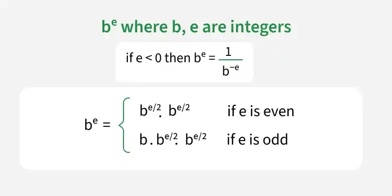
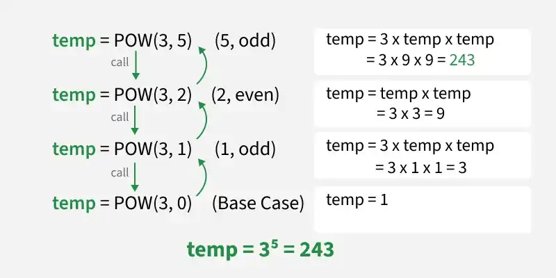

# Power Function Implementation
*Source: GeeksforGeeks — Last Updated: 4 Apr, 2026*

Given two numbers `b` (base) and `e` (exponent), calculate the value of `bᵉ`.

**Examples:**
- Input: `b = 3.00000, e = 5` → Output: `243.00000`
- Input: `b = 0.55000, e = 3` → Output: `0.16638`
- Input: `b = -0.67000, e = -7` → Output: `-16.49971`

---

## [Naive Approach 1] Using Iteration — O(e) Time and O(1) Space

Multiply `b` exactly `e` times using an iterative loop.

```python
def power(b, e):

    # Initialize result to 1
    pow = 1

    # Multiply b for e times
    for i in range(abs(e)):
        pow = pow * b

    if e < 0:
        return 1 / pow

    return pow

if __name__ == "__main__":
    b = 3.0
    e = 5
    res = power(b, e)
    print(res)
```

**Output:**
```
243
```

---

## [Naive Approach 2] Using Recursion — O(e) Time and O(e) Space

Recursively multiply `b` exactly `e` times. The function returns `1` if `e == 0`, handles negative exponents via reciprocal, and otherwise returns `b * power(b, e - 1)`.

```python
def power(b, e):

    # Base Case: pow(b, 0) = 1
    if e == 0:
        return 1

    if e < 0:
        return 1 / power(b, -e)

    # For all other cases
    return b * power(b, e - 1)

if __name__ == "__main__":
    b = 3.0
    e = 5
    res = power(b, e)
    print(res)
```

**Output:**
```
243
```

---

## [Expected Approach] Using Divide and Conquer — O(log e) Time and O(log e) Space

The idea is to use **Divide and Conquer** and recursively bisect `e` in two equal parts. There are two possible cases:

- If `e` is even: `power(b, e) = power(b, e/2) × power(b, e/2)`
- If `e` is odd: `power(b, e) = b × power(b, e/2) × power(b, e/2)`





```python
# Recursive function to calculate pow(b, e)
def power(b, e):

    # Base Case: pow(b, 0) = 1
    if e == 0:
        return 1

    # If exponent is negative, use the reciprocal rule: b^(-e) = 1 / b^e
    if e < 0:
        return 1 / power(b, -e)

    # Recursively calculate power for half the exponent
    temp = power(b, e // 2)

    # If exponent is even: b^e = (b^(e/2))^2
    if e % 2 == 0:
        return temp * temp
    else:
        # If exponent is odd: b^e = b * (b^(e/2))^2
        return b * temp * temp

if __name__ == "__main__":
    b = 3.0
    e = 5
    res = power(b, e)
    print(res)
```

**Output:**
```
243
```

---

## Using Inbuilt Functions — O(log e) Time and O(1) Space

Most languages provide optimized built-in functions that handle negative exponents and floating-point numbers automatically:

| Language   | Syntax                        |
|:----------:|:-----------------------------:|
| Python     | `pow(b, e)` or `b ** e`       |
| C++        | `pow(b, e)`                   |
| Java       | `Math.pow(b, e)`              |
| C#         | `Math.Pow(b, e)`              |
| JavaScript | `Math.pow(b, e)` or `b ** e`  |

```python
def power(b, e):

    # using (**) operator
    # return b**e

    # Return type of pow() function is double
    return pow(b, e)

if __name__ == "__main__":
    b = 3.0
    e = 5
    print(power(b, e))
```

**Output:**
```
243
```

---

## Related Articles

- Iterative function for `pow(x, y)`
- Modular Exponentiation (Power in Modular Arithmetic)