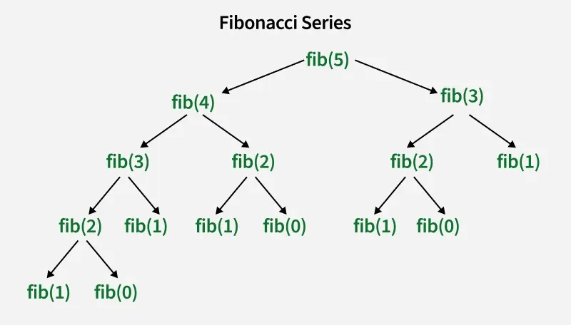

# Introduction to Recursion
*Source: GeeksforGeeks — Last Updated: 10 Apr, 2026*

The process in which a function calls itself directly or indirectly is called **recursion**, and the corresponding function is called a **recursive function**.

- A recursive algorithm takes one step toward the solution, then recursively calls itself to continue.
- The algorithm stops once the solution is reached.
- Since the called function may call itself again, this process could continue forever — so it is essential to provide a **base case** to terminate the recursion.

---

## Steps to Implement Recursion

**Step 1 — Define a base case:** Identify the simplest case for which the solution is known or trivial. This is the **stopping condition** that prevents infinite recursion.

**Step 2 — Define a recursive case:** Break the problem down into smaller versions of itself and call the function recursively to solve each subproblem.

**Step 3 — Ensure the recursion terminates:** Make sure the recursive function eventually reaches the base case and does not enter an infinite loop.

**Step 4 — Combine the solutions:** Combine the solutions of the subproblems to solve the original problem.

---

## Example 1: Sum of Natural Numbers

**Input:** `n = 3` → **Output:** `6` *(1 + 2 + 3)*  
**Input:** `n = 7` → **Output:** `28` *(1 + 2 + ... + 7)*

- **Base Case:** at `n == 1`, return `1`
- **Recursive Case:** `sum(n) = n + sum(n-1)`

```python
def sum(n):
    # base condition
    if n == 1:
        return 1
    return n + sum(n - 1)

if __name__ == "__main__":
    n = 5
    print(sum(n))
```

**Output:**
```
15
```

**Execution Flow:** calls are stacked as `sum(3) → sum(2) → sum(1)` before any addition happens. Results are added back in reverse: `sum(1) = 1`, `sum(2) = 3`, `sum(3) = 6`.

---

## Comparison of Recursive and Iterative Approaches

### Why Use Recursion?

- Recursion helps in **logic building** and solving complex problems by breaking them into smaller subproblems.
- Recursive solutions serve as the basis for **Dynamic Programming** and **Divide and Conquer** algorithms.
- Certain problems are solved more naturally with recursion: **Tower of Hanoi**, **tree traversals** (Inorder/Preorder/Postorder), **DFS of Graph**, etc.

### What is the Base Condition?

A recursive program stops at a **base condition**. There can be more than one base condition. In the sum example above, the base condition is `n == 1`.

### How is a Problem Solved Using Recursion?

The idea is to represent a problem in terms of **one or more smaller problems**, and add one or more base conditions that stop the recursion.

---

## Example 2: Factorial of a Number

The factorial of `n` (where `n >= 0`) is the product of all positive integers from `1` to `n`. The base case is `n == 0`, returning `1`.

```python
def fact(n):
    # BASE CONDITION
    if n == 0:
        return 1
    return n * fact(n - 1)

print("Factorial of 5 :", fact(5))
```

**Output:**
```
Factorial of 5 : 120
```

**Illustration of the above code:**


---

## When Does Stack Overflow Occur?

If the base case is not reached or not defined, a **stack overflow** error may arise:

```cpp
int fact(int n) {
    // wrong base case (may cause stack overflow)
    if (n == 100)
        return 1;
    else
        return n * fact(n - 1);
}
```

If `fact(10)` is called, `n` will never reach `100` — the recursion continues indefinitely, consuming all stack memory.  
**Fix:** use a correct base case like `if (n == 0)`.

---

## Direct vs Indirect Recursion

**Direct recursion:** a function calls itself directly within its own body.

**Indirect recursion:** a function calls another function, which in turn calls the original — creating a chain of recursive calls.

```cpp
// Direct recursion
void directRecFun() {
    directRecFun();
}

// Indirect recursion
void indirectRecFun1() {
    indirectRecFun2();
}
void indirectRecFun2() {
    indirectRecFun1();
}
```

---

## Tail vs Non-Tail Recursion

A recursive function is **tail recursive** when the recursive call is the **last thing executed** by the function.

---

## How Memory is Allocated in Recursion

- Recursion uses more memory to store data of every recursive call in an **internal function call stack**.
- Each function call adds a record to the stack, remaining there until the call finishes.
- The stack follows **LIFO** structure — the last called function finishes first.
- When the base case is reached, functions return their values and memory is **de-allocated** progressively.

```python
def printFun(test):
    if test < 1:
        return
    else:
        print(test, end=" ")
        printFun(test - 1)
        print(test, end=" ")
        return

test = 3
printFun(test)
```

**Output:**
```
3 2 1 1 2 3
```

The memory stack **grows** with each call and **shrinks** as the recursion unwinds, following the LIFO structure.

---

## Advantages of Recursion over Iteration

- Provides a **clean and simple** way to write code.
- Some problems are **inherently recursive** (tree traversals, Tower of Hanoi) — recursive code is preferred for these.

## Disadvantages of Recursion over Iteration

> Note: every recursive program can be written iteratively, and vice versa.

- Recursive programs typically have **more space requirements** and more time to maintain the call stack.
- Recursion can make code **more difficult to understand and debug**, as it requires thinking about multiple levels of function calls.

---

## Example 3: Fibonacci Series with Recursion

**Mathematical equation:**
$$fib(n) = \begin{cases} n & \text{if } n = 0 \text{ or } n = 1 \\ fib(n-1) + fib(n-2) & \text{otherwise} \end{cases}$$

**Recurrence relation:** `T(n) = T(n-1) + T(n-2) + O(1)`

```python
def fib(n):
    if n == 0:
        return 0
    if n == 1 or n == 2:
        return 1
    else:
        return fib(n - 1) + fib(n - 2)

n = 5
print("Fibonacci series of 5 numbers is :", end=" ")
for i in range(0, n):
    print(fib(i), end=" ")
```

**Output:**
```
Fibonacci series of 5 numbers is: 0 1 1 2 3
```

**Recursion Tree for the above code:**



---

## Common Applications of Recursion

- **Tree and Graph Traversal** — systematically exploring nodes/vertices in data structures.
- **Sorting Algorithms** — Quicksort and Merge Sort divide data into subarrays, sort them recursively, and merge them.
- **Divide-and-Conquer** — Binary Search breaks problems into smaller subproblems using recursion.
- **Fractal Generation** — generating patterns like the Mandelbrot set by repeatedly applying a recursive formula.
- **Backtracking Algorithms** — exploring all possible paths and backtracking when needed.
- **Memoization** — caching results of recursive calls to avoid recomputing expensive subproblems.

---

## Summary

- Recursion has two types of cases: a **recursive case** and a **base case**.
- The **base case** terminates the recursion when its condition is true.
- Each recursive call creates a **new copy** of the function in stack memory.
- **Infinite recursion** may lead to running out of stack memory.
- Examples of recursive algorithms: **Merge Sort, Quick Sort, Tower of Hanoi, Fibonacci Series, Factorial**.