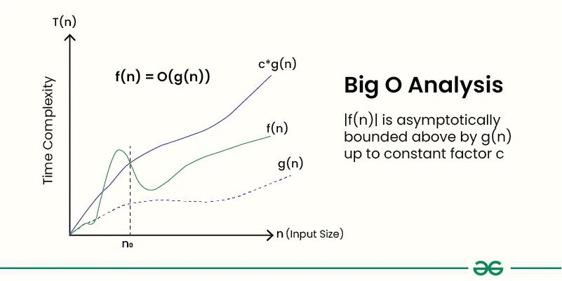
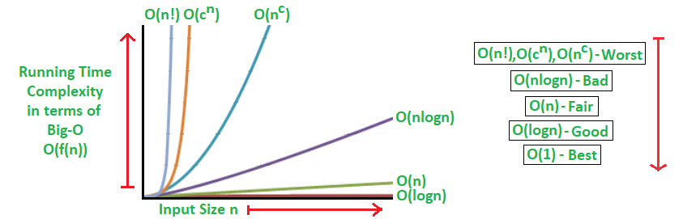

# Big O Notation
*Source: GeeksforGeeks — Last Updated: 28 Mar, 2026*

Big O notation is used to describe the **time or space complexity** of algorithms. It expresses an **upper bound** of an algorithm's time or space complexity.

- Describes the asymptotic behavior (order of growth of time or space in terms of input size) of a function, not its exact value.
- Can be used to compare the efficiency of different algorithms or data structures.
- Provides an upper limit on the time taken by an algorithm in terms of the size of the input.
- We mainly consider the **worst case scenario** to find time complexity in terms of Big O.

---

## Big O Definition

Given two functions `f(n)` and `g(n)`, we say that `f(n)` is `O(g(n))` if there exist constants `c > 0` and `n₀ >= 0` such that:

$$f(n) \leq c \cdot g(n) \quad \text{for all } n \geq n_0$$

In simpler terms, `f(n)` is `O(g(n))` if `f(n)` grows no faster than `c·g(n)` for all `n >= n₀`, where `c` and `n₀` are constants.



---

## A Quick Way to Find Big O of an Expression

1. **Ignore the lower order terms** — consider only the highest order term.
2. **Ignore the constant** associated with the highest order term.

**Example 1:** `f(n) = 3n² + 2n + 1000 log n + 5000`
- Highest order term → `3n²`
- After ignoring the constant → `n²`
- ✅ **Big O: O(n²)**

**Example 2:** `f(n) = 3n³ + 2n² + 5n + 1`
- Dominant term → `3n³`
- Order of growth → Cubic
- ✅ **Big O: O(n³)**

---

## Properties of Big O Notation

### 1. Reflexivity
For any function `f(n)`:  `f(n) = O(f(n))`

> **Example:** `f(n) = n²` → `f(n) = O(n²)`

### 2. Transitivity
If `f(n) = O(g(n))` and `g(n) = O(h(n))`, then `f(n) = O(h(n))`.

> **Example:** `f(n) = n²`, `g(n) = n³`, `h(n) = n⁴`  
> → `f(n) = O(g(n))` and `g(n) = O(h(n))` → therefore `f(n) = O(h(n))`

### 3. Constant Factor
If `f(n) = O(g(n))`, then `c·f(n) = O(g(n))` for any constant `c > 0`.

> **Example:** `f(n) = n`, `g(n) = n²` → `f(n) = O(g(n))` → therefore `2f(n) = O(g(n))`

### 4. Sum Rule
If `f(n) = O(g(n))` and `h(n) = O(k(n))`, then:
$$f(n) + h(n) = O(\max(g(n),\ k(n)))$$

> **Example:** `f(n) = n²`, `h(n) = n³` → `f(n) + h(n) = O(max(n², n³)) = O(n³)`

### 5. Product Rule
If `f(n) = O(g(n))` and `h(n) = O(k(n))`, then `f(n) · h(n) = O(g(n) · k(n))`.

> **Example:** `f(n) = n`, `g(n) = n²`, `h(n) = n³`, `k(n) = n⁴`  
> → `f(n) · h(n) = O(g(n) · k(n)) = O(n⁶)`

### 6. Composition Rule
If `f(n) = O(g(n))`, then `f(h(n)) = O(g(h(n)))`.

> **Example:** `f(n) = n²`, `g(n) = n³`, `h(n) = log n`  
> → by composition rule: `(log n)² = O((log n)³)`

---

## Common Big-O Notations

### 1. Linear Time — O(n)
Running time grows linearly with input size.

```cpp
bool findElement(int arr[], int n, int key) {
    for (int i = 0; i < n; i++) {
        if (arr[i] == key) return true;
    }
    return false;
}
```

### 2. Logarithmic Time — O(log n)
Running time is proportional to the logarithm of the input size.

```cpp
int binarySearch(int arr[], int l, int r, int x) {
    if (r >= l) {
        int mid = l + (r - l) / 2;
        if (arr[mid] == x) return mid;
        if (arr[mid] > x) return binarySearch(arr, l, mid - 1, x);
        return binarySearch(arr, mid + 1, r, x);
    }
    return -1;
}
```

### 3. Quadratic Time — O(n²)
Running time is proportional to the square of the input size.

```cpp
void bubbleSort(int arr[], int n) {
    for (int i = 0; i < n - 1; i++)
        for (int j = 0; j < n - i - 1; j++)
            if (arr[j] > arr[j + 1])
                swap(&arr[j], &arr[j + 1]);
}
```

### 4. Cubic Time — O(n³)
Running time is proportional to the cube of the input size.

```cpp
void multiply(int mat1[][N], int mat2[][N], int res[][N]) {
    for (int i = 0; i < N; i++)
        for (int j = 0; j < N; j++) {
            res[i][j] = 0;
            for (int k = 0; k < N; k++)
                res[i][j] += mat1[i][k] * mat2[k][j];
        }
}
```

### 5. Polynomial Time — O(nᵏ)
Time complexity expressible as a polynomial of `n`. Includes O(n), O(n²), O(n³), and is generally considered **efficient**.

### 6. Exponential Time — O(2ⁿ)
Running time doubles with each addition to the input.

```cpp
void generateSubsets(int arr[], int n) {
    for (int i = 0; i < (1 << n); i++) {
        for (int j = 0; j < n; j++)
            if (i & (1 << j)) cout << arr[j] << " ";
        cout << endl;
    }
}
```

### 7. Factorial Time — O(n!)
Running time grows factorially — often seen in permutation algorithms.

```cpp
void permute(int* a, int l, int r) {
    if (l == r) {
        for (int i = 0; i <= r; i++) cout << a[i] << " ";
        cout << endl;
    } else {
        for (int i = l; i <= r; i++) {
            swap(a[l], a[i]);
            permute(a, l + 1, r);
            swap(a[l], a[i]); // backtrack
        }
    }
}
```

If we plot the most common Big O notation examples, we get the following graph:



---

## Mathematical Examples of Runtime Analysis

| n  | log(n) | n  | n·log(n) | n²  | 2ⁿ      | n!                  |
|:--:|:------:|:--:|:--------:|:---:|:-------:|:-------------------:|
| 10 | 1      | 10 | 10       | 100 | 1 024   | 3 628 800           |
| 20 | 2.996  | 20 | 59.9     | 400 | 1 048 576 | 2.432902e+18      |

---

## Algorithmic Examples of Runtime Analysis
| Type        | Notation   | Example Algorithms                                                                 |
|:------------|:----------:|:-----------------------------------------------------------------------------------|
| Logarithmic | O(log n)   | Binary Search                                                                      |
| Linear      | O(n)       | Linear Search                                                                      |
| Superlinear | O(n log n) | Heap Sort, Merge Sort                                                              |
| Polynomial  | O(nᶜ)      | Strassen's Matrix Multiplication, Bubble Sort, Selection Sort, Insertion Sort, Bucket Sort |
| Exponential | O(cⁿ)      | Tower of Hanoi                                                                     |
| Factorial   | O(n!)      | Determinant Expansion by Minors, Brute force Traveling Salesman Problem            |