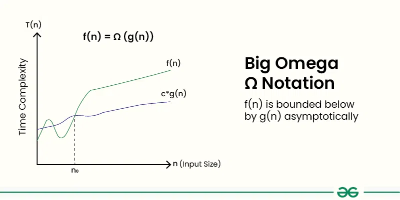

# Omega (Ω) Notation
*Source: GeeksforGeeks — Last Updated: 28 Mar, 2026*

In the **analysis of algorithms**, asymptotic notations are used to denote a **lower bound** on the asymptotic time taken by an algorithm.

- It analyses the **best-case situation** of an algorithm and provides an equal or lower limit on the time taken in terms of input size.
- We use it when we want to represent that the algorithm will take **at least** a certain amount of time or space.
- For any algorithm, we can say its time complexity is **Ω(1)**, as it represents a constant value — in this notation we only guarantee a lower bound. However, it is always recommended to find as **tight a lower bound** as possible.

---

## Definition

Given two functions `g(n)` and `f(n)`, we say that `f(n) = Ω(g(n))` if there exist constants `c > 0` and `n₀ >= 0` such that:

$$f(n) \geq c \cdot g(n) \quad \text{for all } n \geq n_0$$

In simpler terms, `f(n)` is `Ω(g(n))` if `f(n)` will always grow **faster than or equal to** `c·g(n)` for all `n >= n₀`, where `c` and `n₀` are constants.



---

## How to Determine Big-Omega Ω Notation

In simple terms, **Big-Omega Ω notation** specifies the **asymptotic lower bound** for a function `f(n)`. It bounds the growth of the function from below as the input grows infinitely large.

1. Break the algorithm into smaller segments such that each segment has a certain runtime complexity.
2. Find the number of operations performed for each segment (in terms of input size), assuming the input is such that the program takes the **least amount of time**.
3. Add up all the operations and simplify — call the result `f(n)`.
4. Remove all constants and choose the term with the **least order**, or any function that is always less than `f(n)` when `n → ∞`.

---

## Example: Print All Pairs of an Array

Consider printing all possible pairs of an array using two nested loops:

```python
def print_pairs(a, n):
    for i in range(n):
        for j in range(n):
            if i != j:
                print(a[i], a[j])

# Driver Code
a = [1, 2, 3]
n = len(a)
print_pairs(a, n)
```

**Output:**
```
1 2
1 3
2 1
2 3
3 1
3 2
```

In this example, the print statement executes **n²** times. When `n → ∞`, the best-case running time can be expressed as `Ω(n²)`, `Ω(log n)`, `Ω(n)`, `Ω(1)`, or any function `g(n) <= n²`.  
However, it is recommended to always use the **closest lower bound** to give a good idea of the actual time.

---

## Big O vs Big Ω vs Θ (Theta)

| Notation | Definition | Explanation |
|:--------:|:-----------|:------------|
| **Big O (O)** | `f(n) ≤ C · g(n)` for all `n ≥ n₀` | Upper bound on running time. **Used most of the time.** |
| **Ω (Omega)** | `f(n) ≥ C · g(n)` for all `n ≥ n₀` | Lower bound on running time. Used less. |
| **Θ (Theta)** | `C₁·g(n) ≤ f(n) ≤ C₂·g(n)` for `n ≥ n₀` | Both upper and lower bounds. **Preferred over Big O when an exact bound is available.** |

In each notation:
- `f(n)` represents the function being analyzed — typically the algorithm's time complexity.
- `g(n)` represents a specific function that bounds `f(n)`.
- `C`, `C₁`, and `C₂` are constants.
- `n₀` is the minimum input size beyond which the inequality holds.