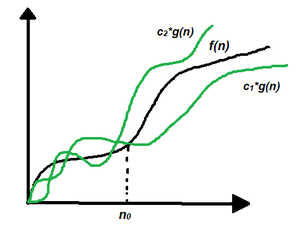

# Theta Notation for Analysis
*Source: GeeksforGeeks — Last Updated: 9 Apr, 2026*

In the **analysis of algorithms**, asymptotic notations are used to evaluate the performance of an algorithm by providing an exact order of growth.

- **Theta (Θ) Notation** provides an **exact bound** on time or space complexity, as it bounds a function from **both upper and lower sides**.
- Compared to Big O or Big Omega, it gives more information in cases where we have an exact bound available and should be preferred.
  - For **Merge Sort** (always O(n log n)): time is **Θ(n log n)**
  - For **Binary Search** worst case: time is **Θ(log n)**

---

## Definition

Let `g` and `f` be functions from the set of natural numbers to itself. The function `f` is said to be **Θ(g)** if there are constants `c1, c2 > 0` and a natural number `n₀` such that:

$$c_1 \cdot g(n) \leq f(n) \leq c_2 \cdot g(n) \quad \text{for all } n \geq n_0$$

More formally:

$$\Theta(g(n)) = \{\ f(n)\ :\ \exists\ c_1, c_2 > 0,\ n_0 \geq 0 \text{ such that } 0 \leq c_1 \cdot g(n) \leq f(n) \leq c_2 \cdot g(n),\ \forall\ n \geq n_0\ \}$$

> **Note:** Θ(g) is a **set**.

The definition means that if `f(n)` is Theta of `g(n)`, then the value `f(n)` is always **between** `c1·g(n)` and `c2·g(n)` for large values of `n` (i.e., `n >= n₀`). It also requires that `f(n)` must be **non-negative** for all `n > n₀`.

---

## Graphical Representation



In simple terms, **Big-Theta (Θ) notation** specifies **asymptotic bounds** (both upper and lower) for a function `f(n)`.

---

## Example: Linear Search

Consider finding whether a key exists in an array using **linear search** — traverse the array and check every element.

**Pseudo-code:**

```cpp
bool linearSearch(int a[], int n, int key) {
    for (int i = 0; i < n; i++) {
        if (a[i] == key)
            return true;
    }
    return false;
}
```

**Python implementation:**

```python
# Function to find whether a key exists in an array using linear search
def linearSearch(a, n, key):
    for i in range(0, n):
        if a[i] == key:
            return True
    return False

# Driver Code
arr = [2, 3, 4, 10, 40]
x = 10
n = len(arr)

if linearSearch(arr, n, x):
    print("Element is present in array")
else:
    print("Element is not present in array")
```

**Output:**
```
Element is present in array
```

---

## Average Case Complexity of Linear Search

Assuming all cases are **uniformly distributed** (including when the key is absent), we sum all cases and divide by `n + 1`:

$$\text{Average case} = \frac{\sum_{i=1}^{n+1} \Theta(i)}{n+1}$$

$$\Rightarrow \frac{\Theta\left(\frac{(n+1)(n+2)}{2}\right)}{n+1}$$

$$\Rightarrow \Theta\left(1 + \frac{n}{2}\right)$$

$$\Rightarrow \Theta(n) \quad \text{(constants are removed)}$$

---

## When to Use Big-Θ Notation

- Big-Θ analyzes an algorithm with the **most precise accuracy**, as it considers a uniform distribution of different types and lengths of inputs.
- It provides the **average time complexity**, which is the most precise measure for analysis.
- However, in practice, it can sometimes be **difficult to define a uniformly distributed input set** for an algorithm.
- In such cases, **Big-O notation** is preferred, as it represents the **asymptotic upper bound** of a function `f`.